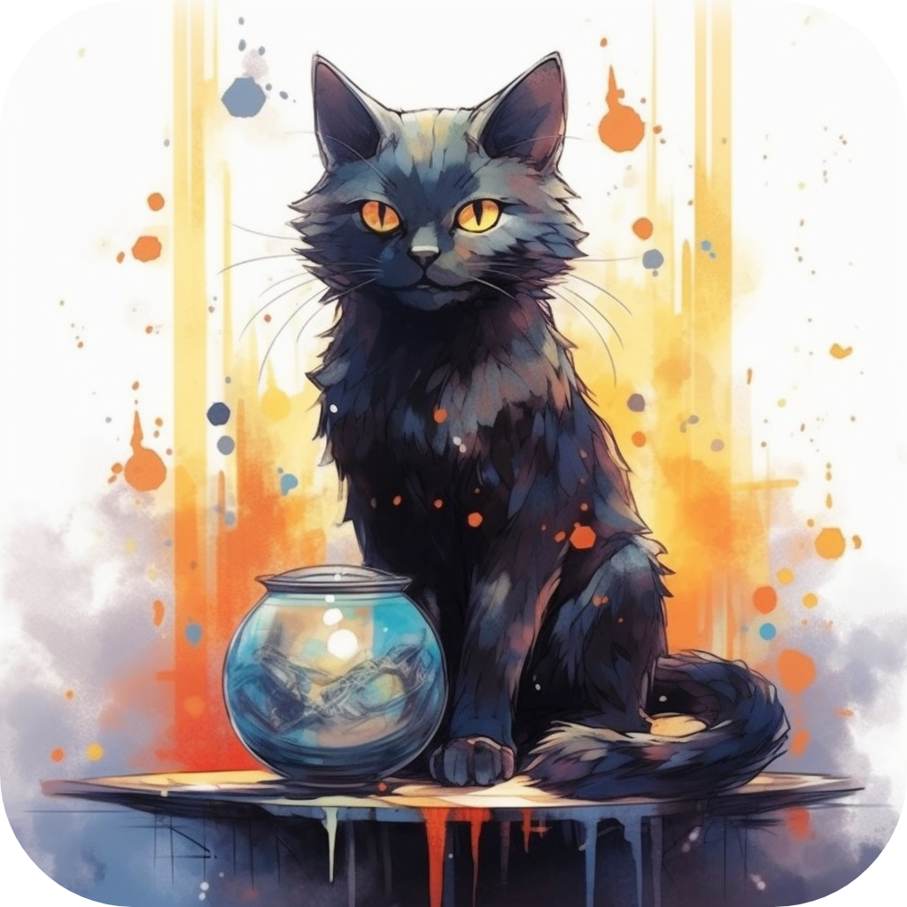

  
  <h1>Destiny Cat</h1>
  
  

    A LLM about destiny prediction.🔮
  

  <!-- Badges -->

  
  
  
  
  
  

# 🎹Table of Contents
- [🎹Table of Contents](#table-of-contents)
- [🔮About this Project](#about-this-project)
  - [🥼Tech Stack](#tech-stack)
  - [🎯Features](#features)
- [🧵Getting Started](#getting-started)

# 🔮About this Project

This project is meant to build a LLM about **destiny prediction**（算命）. 

Destiny prediction is a popular culture among the world. This repository is inspired by a senior sister who is falling love to helping people to solve their life question using destiny prediction based on Chinese traditional destiny toolkit called “命理” .

## 🥼Tech Stack
* Based on LLaMA
* ...

## 🎯Features
* A whole new database about destiny prediction
* ...

# 🧵Getting Started

* ...